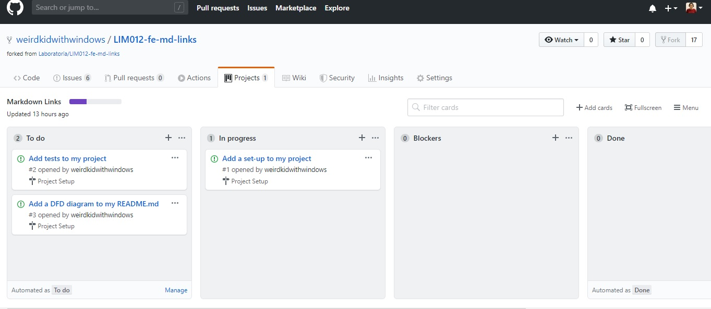
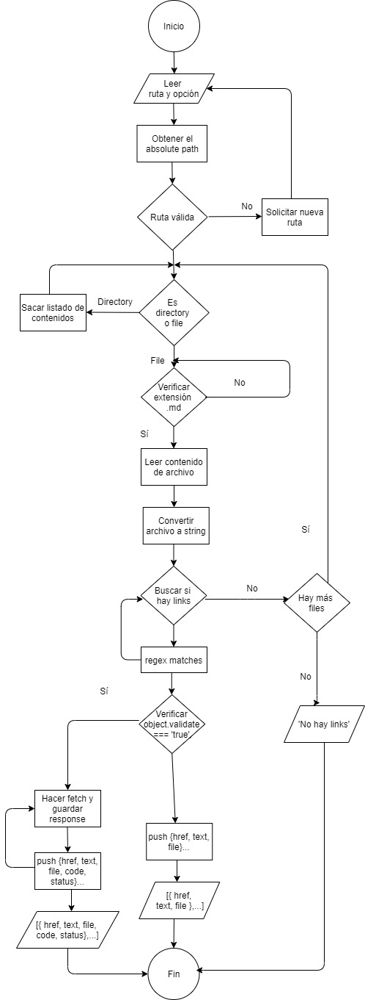

# Markdown Links

Dentro de una comunidad de código abierto, nos han propuesto crear una
herramienta usando [Node.js] que lea y analice archivos en formato `Markdown`
para verificar los links que contengan y reportar algunas estadísticas.

## Objetivo

El objetivo práctico de este proyecto es que crear mi propia _library_ en JavaScript.

## Criterios de aceptación

### Arquitectura del proyecto 

```
.
├── README.md
├── package.json
├── index.js
└── src
  └── mdLinks.js
└── tests
  └── mdLinks.spec.js
```

### Planificación del proyecto

Kanban board en GitHub: 



### DFD de algoritmo



### Documentación técnica

### Guía de usuario para instalación y uso

## Objetivos de aprendizaje

### Javascript
- [ ] Uso de callbacks
- [ ] Consumo de Promesas
- [ ] Creación de Promesas
- [x] Módulos de JS
- [ ] Recursión

### Node
- [ ] Sistema de archivos
- [x] package.json
- [ ] Crear modules
- [x] Instalar y usar modules
- [x] npm scripts
- [ ] CLI

### Testing
- [ ] Testeo de funciones
- [ ] Testeo asíncrono
- [ ] Uso de librerías de Mock
- [ ] Mocks manuales
- [ ] Testeo para múltiples OS

### Git y Github
- [x] Organización en Github

### Buenas prácticas de desarrollo
- [ ] Modularización
- [ ] Nomenclatura / Semántica
- [x] Linting
