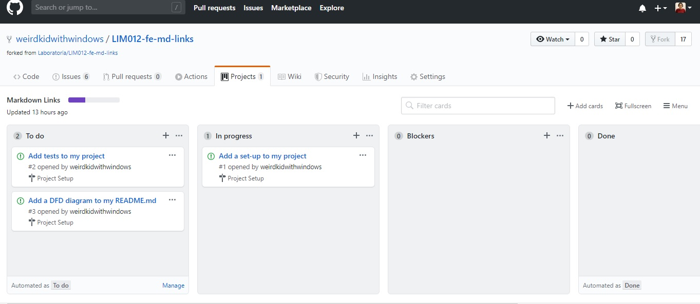
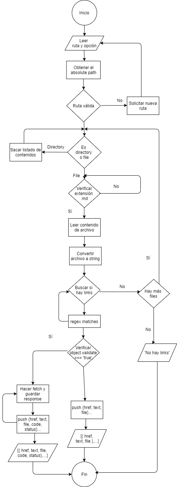
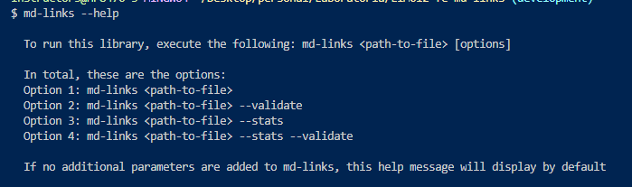
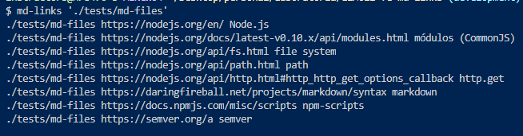
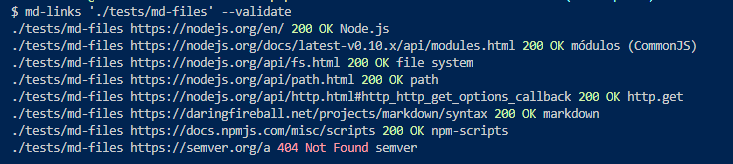
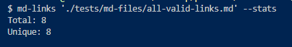
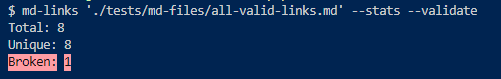

# Markdown Links

Dentro de una comunidad de código abierto, nos han propuesto crear una
herramienta usando `Node.js` que lea y analice archivos en formato `Markdown`
para verificar los links que contengan y reportar algunas estadísticas.

## Objetivo

El objetivo práctico de este proyecto es que crear mi propia _library_ en JavaScript.

## Criterios de aceptación

### Arquitectura del proyecto 

```
.
├── README.md
├── package.json
├── cli.js
└── src
  └── mdLinks.js
  └── utils.js
└── tests
  └── utils.spec.js
  └── mock-data.js
  └── md-files
```

### Planificación del proyecto

Kanban board en GitHub: 



### DFD de algoritmo



### Documentación técnica

Actualmente, el programa no contempla los siguientes casos: 

Timeout errors; 

Una gran cantidad de links que pudiera provocar error en el fetch;

Tests de integración para el CLI: llamar a la librería con dos parámetros y testear que se están recibiendo;

Testeo para múltiples OS.

### Guía de usuario para instalación y uso

Este módulo md-links contiene tanto un archivo ejecutable desde la terminal, así como una API
que puede ser utilizada programáticamente con `require`. 

## API usage

Para hacer uso del módulo, es necesario invocar la función mdLinks(), la cual recibe dos parámetros:
`path` que puede ser una ruta absoluta o relativa al archivo markdown o directorio que se busca analizar,
y un segundo parámetro opcional `validate` que es un un booleano dentro de un objeto. 
La API retorna una promesa que resuelve a un array. La promesa luego sería _thenable_ para hacer el uso que se desee de los valores del resolve.

Sus ejemplos de uso serían los siguientes:

```
const mdLinks = require("md-links"); // por default el valor de validate es false

mdLinks("./some/example.md") 
  .then((arr) => console.log(arr)) // [{ href, text, file }]
  .catch((err) => console.error(err.message));

mdLinks("./some/example.md", { validate: true })
  .then((arr) => console.log(arr)) // [{ href, text, file, status, ok }]
  .catch((err) => console.error(err.message));
```

## CLI usage

Para hacer uso del CLI es necesario instalarlo via `npm install --global weirdkidwithwindows/LIM012-fe-md-links`.

Existen diferentes opciones de su uso, las cuales se pueden encontrar bajo el flag de help, que 
puede ser accedido de las tres siguientes maneras:

``` 
md-links
md-links --help
md-links -h
```

Las anteriores opciones loggean la siguiente guía:



Si el usuario ingresa un path hacia archivo o directorio de archivos markdown que desea analizar,
y no ingresa ningún parámetro adicional, únicamente mostrará los links, sin ningún dato adicional:



Si el usuario ingresa, además, el flag `--validate` obtendrá información sobre el status
http de cada link:



Si el usuario ingresa el flag `---stats` obtendrá información sobre el conjunto de links:



Finalmente, se pueden combinar ambas opciones para obtener las estadísticas completas sobre el conjunto
de links:



## Objetivos de aprendizaje

### Javascript
- [x] Uso de callbacks
- [x] Consumo de Promesas
- [x] Creación de Promesas
- [x] Módulos de JS
- [x] Recursión

### Node
- [x] Sistema de archivos
- [x] package.json
- [x] Crear modules
- [x] Instalar y usar modules
- [x] npm scripts
- [x] CLI

### Testing
- [x] Testeo de funciones
- [x] Testeo asíncrono
- [ ] Uso de librerías de Mock
- [ ] Mocks manuales
- [ ] Testeo para múltiples OS

### Git y Github
- [x] Organización en Github

### Buenas prácticas de desarrollo
- [x] Modularización
- [x] Nomenclatura / Semántica
- [x] Linting
